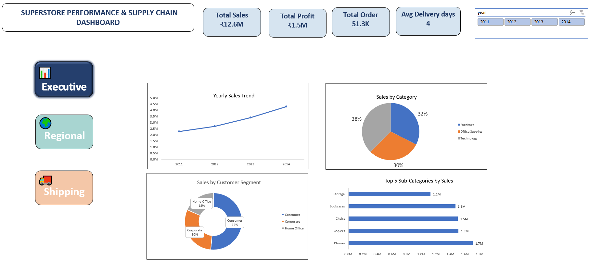
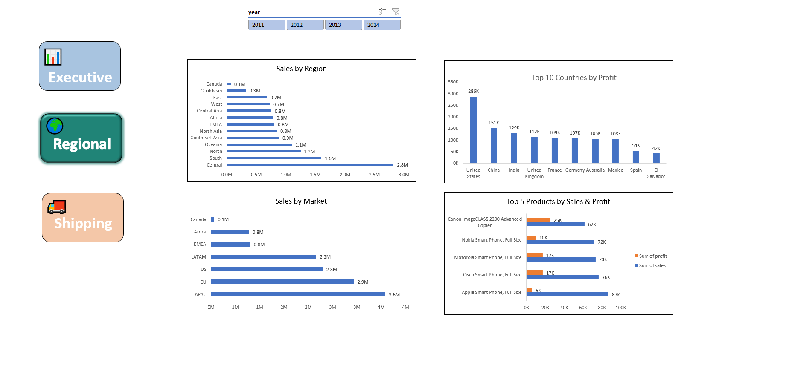
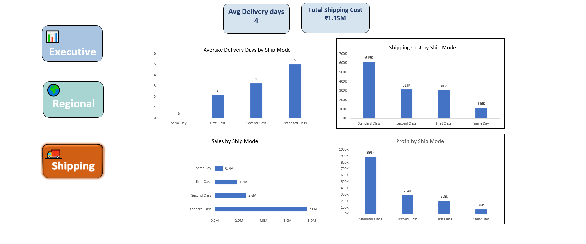

# 📊 Superstore Performance & Supply Chain Dashboard

## Project Overview

The **Superstore Performance & Supply Chain Dashboard** is an interactive Microsoft Excel dashboard developed using the Global Superstore dataset. The project transforms raw transactional data into actionable business insights through dynamic visualizations, KPI tracking, and interactive filtering.

This dashboard enables stakeholders to monitor sales performance, profitability, regional trends, customer segments, and shipping efficiency in a single reporting solution.

---

## Business Objectives

* Analyze overall sales and profit performance
* Identify high-performing products and categories
* Evaluate regional and market-wise performance
* Monitor shipping costs and delivery efficiency
* Support data-driven business decision making

---

## Dashboard Structure

### 📌 Executive Dashboard

Provides a high-level overview of business performance through key metrics and trend analysis.

**Key Metrics**

* Total Sales
* Total Profit
* Total Orders
* Average Delivery Days

**Visualizations**

* Yearly Sales Trend
* Sales by Category
* Sales by Customer Segment
* Top 5 Sub-Categories by Sales

---

### 🌍 Regional Analysis Dashboard

Focused on geographical and market performance analysis.

**Visualizations**

* Sales by Region
* Sales by Market
* Top 10 Countries by Profit
* Top 5 Products by Sales & Profit

---

### 🚚 Shipping Analysis Dashboard

Provides insights into logistics and supply chain performance.

**Visualizations**

* Average Delivery Days by Ship Mode
* Shipping Cost by Ship Mode
* Sales by Ship Mode
* Profit by Ship Mode

---

## Tools & Techniques Used

* Microsoft Excel
* Pivot Tables
* Pivot Charts
* Slicers
* KPI Cards
* Hyperlinked Navigation Buttons
* Data Cleaning & Transformation
* Dashboard Design & Reporting

---

## Key Insights

* Generated over **₹12.6M** in total sales.
* Achieved approximately **₹1.5M** in total profit.
* Processed more than **51K orders**.
* Maintained an average delivery time of **4 days**.
* Identified top-performing regions, products, and customer segments.
* Evaluated shipping efficiency and logistics performance across ship modes.

---

## Skills Demonstrated

* Data Analysis
* Business Intelligence Reporting
* Dashboard Development
* Data Visualization
* KPI Monitoring
* Excel Automation Techniques
* Supply Chain Analytics
* Performance Analysis

---

## Dashboard Preview

### 1. Executive Dashboard

### 2. Regional Analysis

### 3. Shipping & Logistics Dashboard

---

## Dataset

Global Superstore Dataset containing sales, profit, customer, regional, and shipping information used for business performance analysis.

